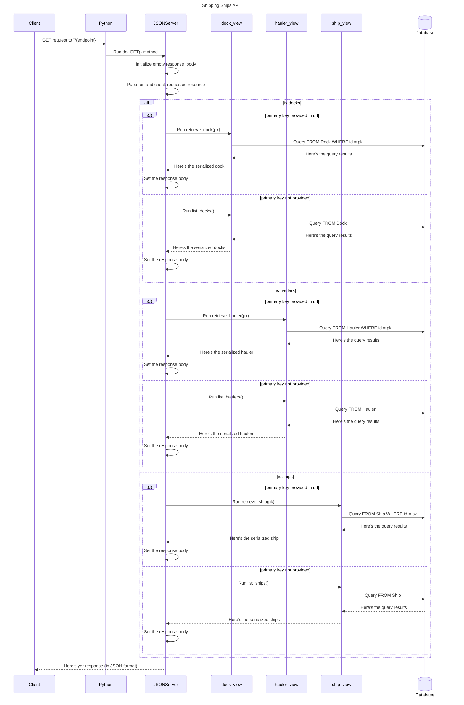

# Shipping Ships API

This version of the API was written with an imperative style of code.

## GET Sequence Diagram

```mermaid
sequenceDiagram
    title Shipping Ships API

    participant Client
    participant Python
    participant JSONServer
    participant dock_view
    participant hauler_view
    participant ship_view
    participant Database@{"type": "database"}
    Client->>Python:GET request to "/{endpoint}"
    Python->>JSONServer:Run do_GET() method
    JSONServer->>JSONServer:initialize empty response_body
    JSONServer->>JSONServer:Parse url and check requested resource
    alt is docks
        alt primary key provided in url
            JSONServer->>dock_view: Run retrieve_dock(pk)
                dock_view->>Database: Query FROM Dock WHERE id = pk
                Database-->>dock_view: Here's the query results
            dock_view-->>JSONServer: Here's the serialized dock
            JSONServer->>JSONServer: Set the response body
        else primary key not provided
            JSONServer->>dock_view: Run list_docks()
                dock_view->>Database: Query FROM Dock
                Database-->>dock_view: Here's the query results
            dock_view-->>JSONServer: Here's the serialized docks
            JSONServer->>JSONServer: Set the response body
        end
    else is haulers
        alt primary key provided in url
            JSONServer->>hauler_view: Run retrieve_hauler(pk)
                hauler_view->>Database: Query FROM Hauler WHERE id = pk
                Database-->>hauler_view: Here's the query results
            hauler_view-->>JSONServer: Here's the serialized hauler
            JSONServer->>JSONServer: Set the response body
        else primary key not provided
            JSONServer->>hauler_view: Run list_haulers()
                hauler_view->>Database: Query FROM Hauler
                Database-->>hauler_view: Here's the query results
            hauler_view-->>JSONServer: Here's the serialized haulers
            JSONServer->>JSONServer: Set the response body
        end
    else is ships
        alt primary key provided in url
            JSONServer->>ship_view: Run retrieve_ship(pk)
                ship_view->>Database: Query FROM Ship WHERE id = pk
                Database-->>ship_view: Here's the query results
            ship_view-->>JSONServer: Here's the serialized ship
            JSONServer->>JSONServer: Set the response body
        else primary key not provided
            JSONServer->>ship_view: Run list_ships()
                ship_view->>Database: Query FROM Ship
                Database-->>ship_view: Here's the query results
            ship_view-->>JSONServer: Here's the serialized ships
            JSONServer->>JSONServer: Set the response body
        end
    end
    JSONServer-->>Client: Here's yer response (in JSON format)
```
